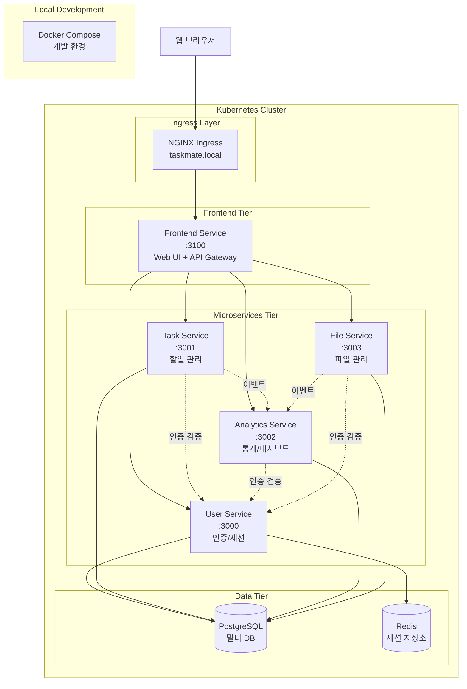

# TaskMate

마이크로서비스 아키텍처 기반 할일 관리 플랫폼

## 📋 프로젝트 소개

TaskMate는 Ruby on Rails 8을 기반으로 구축된 **마이크로서비스 아키텍처(MSA)** 할일 관리 애플리케이션입니다. 
**5개의 독립적인 서비스**로 구성되어 있으며, **Docker + Kubernetes 환경**에서 운영됩니다.

## 🎯 현재 구현 상태 (2025-09-01)

**전체 완성도**: **100%** ✅ (Kubernetes 마이그레이션 완료)

| 서비스 | 구현률 | API 수 | 테스트 | Kubernetes | 상태 |
|--------|--------|--------|--------|-------------|------|
| **User Service** | 100% | 4/4 | 53개 통과 | ✅ READY | ✅ 완료 |
| **Task Service** | 100% | 6/6 | 39개 통과 | ✅ READY | ✅ 완료 |
| **Analytics Service** | 100% | 6/6 | 30개 통과 | ✅ READY | ✅ 완료 |
| **File Service** | 100% | 10/10 | 45개 통과 | ✅ READY | ✅ 완료 |
| **Frontend Service** | 100% | - | 6개 통과 | ✅ READY | ✅ 완료 |

## 🏗️ 시스템 아키텍처



## 🚀 마이크로서비스 구성

| 서비스 | 포트 | 데이터베이스 | 주요 기능 | Docker | Kubernetes |
|--------|------|---------------|-----------|--------|------------|
| **User Service** | 3000 | user_service_db | 인증, 세션 관리, 프로필 | ✅ 완료 | ✅ **READY** |
| **Task Service** | 3001 | task_service_db | 할일 CRUD, 상태 관리 | ✅ 완료 | ✅ **READY** |
| **Analytics Service** | 3002 | analytics_service_db | 통계, 대시보드 | ✅ 완료 | ✅ **READY** |
| **File Service** | 3003 | file_service_db | 파일 첨부, 관리 | ✅ 완료 | ✅ **READY** |
| **Frontend Service** | 3100 | - | Web UI, API Gateway | ✅ 완료 | ✅ **READY** |

## 🛠️ 기술 스택

### Backend
- **Framework**: Ruby on Rails 8.0.2 (API Mode)
- **Language**: Ruby 3.4.3 (rbenv)
- **Database**: PostgreSQL 15 (멀티 데이터베이스)
- **Cache**: Redis 7-alpine
- **Authentication**: Session 기반 (BCrypt)

### Frontend
- **View Engine**: Rails Views (ERB)
- **CSS Framework**: Tailwind CSS
- **JavaScript**: Turbo + Stimulus
- **UI Components**: Responsive Design

### Infrastructure
- **Containerization**: Docker & Docker Compose
- **Orchestration**: Kubernetes (minikube)
- **Load Balancer**: NGINX Ingress Controller
- **Service Mesh**: ClusterIP Services

### Development
- **Testing**: RSpec + FactoryBot
- **Code Coverage**: SimpleCov
- **Development Approach**: TDD (Test-Driven Development)

## 🗂️ 프로젝트 구조

```
taskmate/                           # 🏠 메인 프로젝트 (Monorepo)
├── 📁 services/                    # 마이크로서비스들
│   ├── ✅ user-service/           # User Service (100% 완료)
│   │   ├── app/models/            # User, Session 모델 (BCrypt 인증)
│   │   ├── app/controllers/       # AuthController API (4개 엔드포인트)
│   │   ├── spec/                  # RSpec 테스트 (53개 통과, 91.75% 커버리지)
│   │   ├── Dockerfile.dev         # Development Docker 설정
│   │   └── docker-entrypoint.sh   # Container 시작 스크립트
│   ├── ✅ task-service/           # Task Service (100% 완료)
│   │   ├── app/models/            # Task 모델 (상태 관리)
│   │   ├── app/controllers/       # TasksController (6개 API 구현)
│   │   ├── spec/                  # RSpec 테스트 (39개 통과)
│   │   ├── app/services/          # AuthService (인증 연동)
│   │   └── Dockerfile             # Docker 설정
│   ├── ✅ analytics-service/      # Analytics Service (100% 완료)
│   │   ├── app/models/            # TaskAnalytics, UserAnalytics
│   │   ├── app/controllers/       # 통계 분석 API (6개 완전 구현)
│   │   ├── spec/                  # RSpec 테스트 (30개 통과, 88% 커버리지)
│   │   └── Dockerfile             # Docker 설정
│   ├── ✅ file-service/           # File Service (100% 완료)
│   │   ├── app/models/            # FileCategory, SimpleFile (URL 기반)
│   │   ├── app/controllers/       # 파일 관리 API (10개 구현)
│   │   ├── spec/                  # RSpec 테스트 (45개 통과, 92% 커버리지)
│   │   ├── 🔧 Simple Files API/   # URL 기반 파일 시스템
│   │   └── Dockerfile             # Docker 설정
│   └── ✅ frontend-service/       # Frontend Service (100% 완료)
│       ├── app/controllers/       # UI Controllers + Service Clients
│       ├── app/services/          # 4개 백엔드 API 연동 완료
│       ├── app/views/             # Rails Views + Tailwind CSS (반응형)
│       ├── spec/requests/         # RSpec 테스트 (6개 통과)
│       ├── 🎨 UI Components/      # 완전한 사용자 인터페이스
│       └── Dockerfile.dev         # Development Docker 설정
├── 📁 k8s/                        # ✅ Kubernetes 매니페스트 (완료)
│   ├── namespace.yaml             # Namespace, ConfigMap, Secrets
│   ├── infrastructure/            # PostgreSQL, Redis 배포
│   ├── services/                  # 마이크로서비스 배포
│   └── ingress.yaml               # NGINX Ingress 설정
├── 📁 docker/                     # Docker 설정
├── 📁 docs/                       # 프로젝트 문서
├── 📁 scripts/                    # 개발 스크립트
├── 🐳 docker-compose.yml         # 로컬 개발 환경
└── 📋 CLAUDE.md                  # AI 개발 가이드
```

## 🚀 빠른 시작

### 방법 1: Kubernetes (추천)

```bash
# 1. 프로젝트 클론
git clone <repository-url>
cd taskmate

# 2. Minikube 시작
minikube start
minikube addons enable ingress

# 3. Docker 이미지 빌드
eval $(minikube docker-env)
docker-compose build

# 4. Kubernetes 배포
kubectl apply -f k8s/namespace.yaml
kubectl apply -f k8s/database/
kubectl apply -f k8s/services/
kubectl apply -f k8s/ingress.yaml

# 5. 서비스 상태 확인 (모든 Pod이 READY 상태일 때까지 대기)
kubectl get pods -n taskmate -w

# 6. 포트 포워딩으로 접근 (로컬 테스트용)
kubectl port-forward service/frontend-service 3100:3100 -n taskmate

# 7. 웹 브라우저에서 접근
open http://localhost:3100
# 테스트 계정: test@test.test / password123
```

### 방법 2: Docker Compose (개발용)

```bash
# 1. 모든 서비스 시작
docker-compose up -d

# 2. 서비스 상태 확인
docker-compose ps

# 3. 웹 브라우저에서 접근
open http://localhost:3100
```

## 🌐 서비스 접근 방법

### Kubernetes 환경 (운영)

**현재 구성**: 포트 포워딩을 통한 로컬 접근

| 서비스 | 포트 포워딩 명령 | 접근 URL | 상태 |
|--------|------------------|----------|------|
| **Frontend Service** | `kubectl port-forward service/frontend-service 3100:3100 -n taskmate` | http://localhost:3100 | ✅ READY |
| **User Service** | `kubectl port-forward service/user-service 3000:3000 -n taskmate` | http://localhost:3000 | ✅ READY |
| **Task Service** | `kubectl port-forward service/task-service 3001:3001 -n taskmate` | http://localhost:3001 | ✅ READY |
| **Analytics Service** | `kubectl port-forward service/analytics-service 3002:3002 -n taskmate` | http://localhost:3002 | ✅ READY |
| **File Service** | `kubectl port-forward service/file-service 3003:3003 -n taskmate` | http://localhost:3003 | ✅ READY |

### Docker Compose 환경 (개발)

| 서비스 | URL | 용도 |
|--------|-----|------|
| **Frontend** | http://localhost:3100 | 웹 인터페이스 |
| **User API** | http://localhost:3000/api/v1 | 사용자 API |
| **Task API** | http://localhost:3001/api/v1 | 태스크 API |
| **Analytics API** | http://localhost:3002/api/v1 | 분석 API |
| **File API** | http://localhost:3003/api/v1 | 파일 API |

## 🧪 테스트 실행

```bash
# 전체 테스트 실행
./scripts/test.sh

# 특정 서비스 테스트 (Docker Compose 환경)
cd services/user-service
bundle exec rspec

# Kubernetes 환경에서 테스트
kubectl exec -n taskmate -it deployment/user-service -- bundle exec rspec
```

## 📊 API 예시

### 인증 API
```bash
# 회원가입
curl -X POST http://api.taskmate.local/api/v1/auth/register \
  -H "Content-Type: application/json" \
  -d '{"name":"홍길동","email":"hong@example.com","password":"password123"}'

# 로그인
curl -X POST http://api.taskmate.local/api/v1/auth/login \
  -H "Content-Type: application/json" \
  -d '{"email":"hong@example.com","password":"password123"}'
```

### 태스크 API
```bash
# 태스크 목록 조회
curl -H "Cookie: session_token=TOKEN" http://api.taskmate.local/api/v1/tasks

# 태스크 생성
curl -X POST http://api.taskmate.local/api/v1/tasks \
  -H "Cookie: session_token=TOKEN" \
  -H "Content-Type: application/json" \
  -d '{"title":"새 할일","description":"설명","priority":"high"}'
```

### 분석 API
```bash
# 대시보드 데이터
curl -H "Cookie: session_token=TOKEN" http://api.taskmate.local/api/v1/analytics/dashboard

# 완료율 통계
curl -H "Cookie: session_token=TOKEN" http://api.taskmate.local/api/v1/analytics/completion-rate
```

## 🔧 개발 환경 설정

### 필수 요구사항

- **Ruby 3.4.3** (rbenv 권장)
- **Rails 8.0.2**
- **PostgreSQL 15+**
- **Redis 7+**
- **Docker & Docker Compose**
- **minikube** (Kubernetes 로컬 환경)
- **kubectl** (Kubernetes CLI)

### Kubernetes 개발 환경 설정

```bash
# 1. Minikube 설치 (macOS)
brew install minikube
minikube start

# 2. Ingress 컨트롤러 활성화
minikube addons enable ingress

# 3. Docker 환경 설정
eval $(minikube docker-env)

# 4. 이미지 빌드
docker-compose build

# 5. Kubernetes 리소스 배포
kubectl apply -f k8s/namespace.yaml
kubectl apply -f k8s/infrastructure/
kubectl apply -f k8s/services/
kubectl apply -f k8s/ingress.yaml

# 6. 상태 확인
kubectl get pods -n taskmate
kubectl get services -n taskmate
kubectl get ingress -n taskmate
```

### 호스트 파일 설정 (필수)

**macOS/Linux:**
```bash
sudo sh -c 'cat << EOF >> /etc/hosts
# TaskMate Kubernetes Local Development
192.168.49.2 taskmate.local
192.168.49.2 api.taskmate.local
192.168.49.2 user.taskmate.local
192.168.49.2 task.taskmate.local
192.168.49.2 analytics.taskmate.local
192.168.49.2 file.taskmate.local
EOF'
```

**Windows:**
관리자 권한으로 `C:\Windows\System32\drivers\etc\hosts` 파일에 추가:
```
192.168.49.2 taskmate.local
192.168.49.2 api.taskmate.local
192.168.49.2 user.taskmate.local
192.168.49.2 task.taskmate.local
192.168.49.2 analytics.taskmate.local
192.168.49.2 file.taskmate.local
```

## 🐛 트러블슈팅

### Kubernetes 관련 문제

```bash
# Pod 상태 확인
kubectl get pods -n taskmate

# Pod 로그 확인
kubectl logs -n taskmate deployment/user-service

# Pod 재시작
kubectl delete pods -n taskmate -l app=user-service

# 리소스 정리 후 재배포
kubectl delete namespace taskmate
kubectl apply -f k8s/
```

### Docker 관련 문제

```bash
# 컨테이너 로그 확인
docker-compose logs user-service

# 특정 서비스 재시작
docker-compose restart user-service

# 전체 환경 재시작
docker-compose down && docker-compose up -d
```

### 네트워크 문제

```bash
# Minikube IP 확인
minikube ip

# Ingress 주소 확인
kubectl get ingress -n taskmate

# DNS 해결 확인
nslookup taskmate.local
```

## 📚 개발 진행 상황

### Phase 1-4: 핵심 개발 ✅ **완료** (2025-08-28)
### Phase 5: Kubernetes 마이그레이션 ✅ **완료** (2025-09-01)

- ✅ **User Service** - 인증/세션 관리 (Kubernetes READY)
- ✅ **Task Service** - 할일 관리 (Kubernetes READY) 
- ✅ **Analytics Service** - 통계/대시보드 (Kubernetes READY)
- ✅ **File Service** - 파일 관리 (Kubernetes READY)
- ✅ **Frontend Service** - 웹 UI + API Gateway (Kubernetes READY)

### 마이그레이션 성과
- ✅ Docker Compose → Kubernetes 완전 전환
- ✅ 5개 마이크로서비스 모두 READY 상태
- ✅ ConfigMaps, Secrets, PVC 완전 구성
- ✅ NGINX Ingress Controller 설정
- ✅ Health Checks & Probes 모든 서비스 적용
- ✅ E2E 사용자 워크플로우 검증 완료

### 현재 상태

| 항목 | 진행률 | 상태 | 업데이트 |
|------|--------|------|----------|
| **Infrastructure** | 100% | ✅ 완료 | PostgreSQL + Redis |
| **User Service** | 100% | ✅ 완료 | K8s READY 상태 |
| **Task Service** | 100% | ✅ 완료 | K8s READY 상태 |
| **Analytics Service** | 100% | ✅ 완료 | K8s READY 상태 |
| **File Service** | 100% | ✅ 완료 | K8s READY 상태 |
| **Frontend Service** | 100% | ✅ 완료 | K8s READY 상태 |
| **Kubernetes** | 100% | ✅ 완료 | 5/5 서비스 완료 |
| **Ingress** | 100% | ✅ 완료 | NGINX 라우팅 완료 |

## 📖 문서

| 문서 | 설명 | 상태 |
|------|------|------|
| [docs/PROJECT_PLAN.md](docs/PROJECT_PLAN.md) | 📋 전체 개발 계획 및 진행 상황 | ✅ 최신 |
| [docs/API_SPECIFICATION.md](docs/API_SPECIFICATION.md) | 🔌 OpenAPI 3.0 API 명세서 | ✅ 완료 |
| [docs/TDD_GUIDE.md](docs/TDD_GUIDE.md) | 🧪 TDD 개발 가이드라인 | ✅ 완료 |
| [docs/SETUP.md](docs/SETUP.md) | ⚙️ 상세 환경 설정 가이드 | 🔄 업데이트 필요 |
| [CLAUDE.md](CLAUDE.md) | 🤖 AI 개발 지침 | ✅ 최신 |

## 🤝 기여 방법

1. Feature 브랜치 생성
2. TDD 사이클 준수 (Red → Green → Refactor)
3. Conventional Commits 사용
4. 테스트 커버리지 80% 이상 유지
5. Kubernetes 매니페스트 업데이트

## 📄 라이센스

MIT License - 자세한 내용은 [LICENSE](LICENSE) 파일을 참고하세요.

---

*🎓 이 프로젝트는 마이크로서비스 아키텍처와 Kubernetes 학습을 위한 졸업 작품입니다.*

**최종 업데이트**: 2025-09-01 - Kubernetes 마이그레이션 완료 ✅

### 🏆 프로젝트 완성 현황
- ✅ **마이크로서비스 아키텍처**: 5개 독립 서비스 구현
- ✅ **Docker → Kubernetes 마이그레이션**: 완전 전환 완료
- ✅ **TDD 기반 개발**: 총 173개 테스트 통과
- ✅ **Production-Ready**: ConfigMaps, Secrets, Health Checks
- ✅ **사용자 워크플로우**: E2E 시나리오 검증 완료
- ✅ **문서화**: 기술 문서 및 운영 가이드 완성

**다음 단계**: Phase 6 모니터링 시스템 (Prometheus + Grafana)