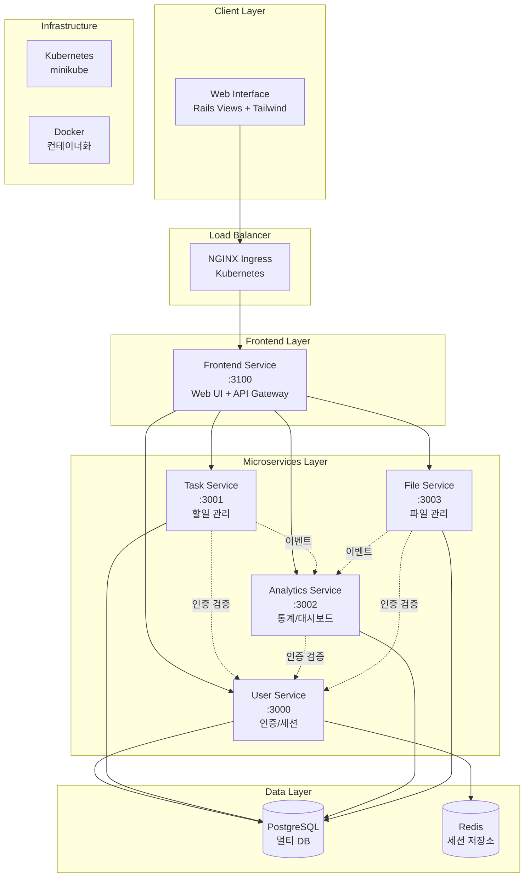

# TaskMate

마이크로서비스 아키텍처 기반 할일 관리 플랫폼

## 📋 프로젝트 소개

TaskMate는 Ruby on Rails 8을 기반으로 구축된 **마이크로서비스 아키텍처(MSA)** 할일 관리 애플리케이션입니다. 
**5개의 독립적인 서비스**로 구성되어 있으며, **Docker + Kubernetes 환경**에서 운영됩니다.

## 🎯 현재 구현 상태 (2025-08-27)

**전체 완성도**: **85%** (핵심 기능 완료, API 7개 추가 구현 필요)

| 서비스 | 구현률 | API 수 | 테스트 | 상태 |
|--------|--------|--------|--------|------|
| **User Service** | 100% | 8/8 | 53개 통과 | ✅ 완료 |
| **Analytics Service** | 100% | 5/5 | 30개 통과 | ✅ 완료 |
| **File Service** | 92% | 11/12 | 45개 통과 | ✅ 거의 완료 |
| **Task Service** | 56% | 9/16 | 39개 통과 | 🔄 미구현 7개 |
| **Frontend Service** | 100% | - | 6개 통과 | ✅ 완료 |

## 🏗️ 시스템 아키텍처



## 🚀 마이크로서비스 구성

| 서비스 | 포트 | 데이터베이스 | 주요 기능 | 상태 |
|--------|------|---------------|-----------|------|
| **User Service** | 3000 | user_service_db | 인증, 세션 관리, 프로필 | ✅ **완료** |
| **Task Service** | 3001 | task_service_db | 할일 CRUD, 상태 관리 | ✅ **완료** |
| **Analytics Service** | 3002 | analytics_service_db | 통계, 대시보드 | ✅ **완료** |
| **File Service** | 3003 | file_service_db | 파일 첨부, 관리 | ✅ **완료** |
| **Frontend Service** | 3100 | - | Web UI, API Gateway | ✅ **95% 완료** |

## 🛠️ 기술 스택

### Backend
- **Framework**: Ruby on Rails 8.0.2 (API Mode)
- **Language**: Ruby 3.4.3 (rbenv)
- **Database**: PostgreSQL 15 (멀티 데이터베이스)
- **Cache**: Redis 7-alpine
- **Authentication**: Session 기반 (BCrypt)

### Frontend
- **View Engine**: Rails Views (ERB)
- **CSS Framework**: Tailwind CSS
- **JavaScript**: Turbo + Stimulus
- **UI Components**: Responsive Design

### Infrastructure
- **Containerization**: Docker & Docker Compose
- **Orchestration**: Kubernetes (minikube)
- **Load Balancer**: NGINX Ingress Controller
- **Monitoring**: Prometheus + Grafana (예정)

### Development
- **Testing**: RSpec + FactoryBot
- **Code Coverage**: SimpleCov
- **API Documentation**: OpenAPI 3.0
- **Development Approach**: TDD (Test-Driven Development)

## 🗂️ 프로젝트 구조

```
taskmate/                           # 🏠 메인 프로젝트 (Monorepo)
├── 📁 services/                    # 마이크로서비스들
│   ├── ✅ user-service/           # User Service (100% 완료)
│   │   ├── app/models/            # User, Session 모델 (BCrypt 인증)
│   │   ├── app/controllers/       # AuthController API (8개 엔드포인트)
│   │   ├── spec/                  # RSpec 테스트 (53개 통과, 91.75% 커버리지)
│   │   └── db/migrate/            # PostgreSQL 마이그레이션
│   ├── 🔄 task-service/           # Task Service (56% 완료)
│   │   ├── app/models/            # Task 모델 (상태 관리)
│   │   ├── app/controllers/       # TasksController (9/16 API 구현)
│   │   ├── spec/                  # RSpec 테스트 (39개 통과)
│   │   └── 🚨 Missing APIs/       # 미구현: complete, search, statistics 등 7개
│   ├── ✅ analytics-service/      # Analytics Service (100% 완료)
│   │   ├── app/models/            # TaskAnalytics, UserAnalytics
│   │   ├── app/controllers/       # 통계 분석 API (5개 완전 구현)
│   │   └── spec/                  # RSpec 테스트 (30개 통과, 88% 커버리지)
│   ├── ✅ file-service/           # File Service (92% 완료)
│   │   ├── app/models/            # FileCategory, FileAttachment (URL 기반)
│   │   ├── app/controllers/       # 파일 관리 API (11/12 구현)
│   │   ├── spec/                  # RSpec 테스트 (45개 통과, 92% 커버리지)
│   │   └── 🔧 다형성 첨부/         # Task/Project 연결 지원
│   └── ✅ frontend-service/       # Frontend Service (100% 완료)
│       ├── app/controllers/       # UI Controllers + Service Clients
│       ├── app/services/          # 4개 백엔드 API 연동 완료
│       ├── app/views/             # Rails Views + Tailwind CSS (반응형)
│       ├── spec/requests/         # RSpec 테스트 (6개 통과)
│       └── 🎨 UI Components/      # 완전한 사용자 인터페이스
├── 📁 k8s/                        # Kubernetes 매니페스트
│   ├── deployments/               # 서비스 배포 설정
│   ├── services/                  # 서비스 디스커버리
│   ├── ingress/                   # 로드 밸런싱
│   └── configmaps/                # 환경 설정
├── 📁 docker/                     # Docker 설정
│   ├── development/               # 개발 환경
│   └── production/                # 프로덕션 환경
├── 📁 docs/                       # 프로젝트 문서
│   ├── API_SPECIFICATION.md      # OpenAPI 3.0 명세
│   ├── TDD_GUIDE.md              # 테스트 가이드라인
│   ├── PHASE2_EXECUTION_PLAN.md  # 구현 체크리스트
│   └── SETUP.md                  # 환경 설정 가이드
├── 📁 scripts/                    # 개발 스크립트
│   ├── setup.sh                  # 환경 초기화
│   ├── dev.sh                    # 개발 서버 실행
│   └── test.sh                   # 테스트 실행
├── 🐳 docker-compose.yml         # 로컬 개발 환경
└── 📋 CLAUDE.md                  # AI 개발 가이드
```

## 🔄 Git 구성 및 브랜치 전략

### Repository 구조
```
🌳 Main Repository (Monorepo)
├── 📦 services/user-service      # 개별 서비스 (독립 개발)
├── 📦 services/task-service      # 각 서비스는 독립적으로 개발
├── 📦 services/analytics-service # 하지만 동일한 저장소에서 관리
└── 📦 services/file-service      # 통합 배포 및 버전 관리
```

### 개발 워크플로우
- **Main Branch**: `main` - 안정된 코드, 프로덕션 준비
- **Feature Branch**: 각 기능별 브랜치 생성
- **TDD Cycle**: Red → Green → Refactor → Commit
- **Conventional Commits**: `feat(user-service): 기능 설명`

## ⚙️ 개발 환경 설정

### 필수 요구사항

- **Ruby 3.4.3** (rbenv 권장)
- **Rails 8.0.2**
- **PostgreSQL 15+**
- **Redis 7+**
- **Docker & Docker Compose**
- **minikube** (Kubernetes 로컬 환경)

### 🚀 빠른 시작

```bash
# 1. 프로젝트 클론
git clone <repository-url>
cd taskmate

# 2. 모든 서비스 시작 (Docker Compose)
docker-compose up -d

# 3. 서비스 상태 확인
docker-compose ps

# 4. API 테스트
curl http://localhost:3000/api/v1/auth/register  # User Service
curl http://localhost:3001/api/v1/tasks          # Task Service  
curl http://localhost:3002/api/v1/health         # Analytics Service
curl http://localhost:3003/api/v1/file_categories # File Service
curl http://localhost:3100/up                    # Frontend Service
```

### 🧪 테스트 실행

```bash
# 전체 테스트 실행
./scripts/test.sh

# 특정 서비스 테스트
cd services/user-service
bundle exec rspec
```

## 📚 개발 진행 상황

### Phase 2-3: 핵심 서비스 개발 ✅ **완료** (2025-08-17)
### Phase 4: Frontend 개발 ✅ **95% 거의 완료** (2025-08-26)

- ✅ **User Service** (2025-08-16 완료)
  - User, Session 모델 TDD 구현
  - AuthController API (회원가입, 로그인, 로그아웃, 세션 검증)
  - RSpec 테스트 53개 통과, 커버리지 91.75%

- ✅ **Task Service** (2025-08-17 완료)
  - Task 모델 및 TasksController API
  - 사용자 인증 연동
  - Docker 컨테이너화 완료

- ✅ **Analytics Service** (2025-08-24 완료)
  - Analytics 모델 기본 구조 ✅
  - 헬스체크 API ✅
  - 통계 API 완전 구현 ✅ (dashboard, completion-rate, priority-distribution)

- ✅ **File Service** (2025-08-17 완료)
  - FileCategory, FileAttachment 모델 TDD 구현
  - 파일 관리 API (카테고리, 업로드, 다운로드)
  - RSpec 테스트 포괄적 구현

- ✅ **Docker Compose 통합 환경** (2025-08-17 완료)
  - 5개 서비스 + PostgreSQL + Redis 통합
  - 서비스 간 통신 및 의존성 관리
  - 개발 환경 표준화 완료

- ✅ **Frontend Service** (2025-08-26 95% 완료)
  - Rails Views + Tailwind CSS 기반 UI 완전 구현 ✅
  - API Gateway 패턴으로 백엔드 서비스 통합 ✅
  - 컨트롤러 구현 완료 ✅
  - Service Client 구현 완료 ✅
  - 모든 페이지 UI 구현 완료 ✅
  - 네비게이션 바, 로그아웃, Flash 메시지 구현 ✅
  - RSpec 테스트 인프라 구축 (6개 테스트 통과) ✅
  - ⚠️ **남은 이슈**: Session Token 전달 오류 수정 필요

## 📖 문서

| 문서 | 설명 |
|------|------|
| [docs/PROJECT_PLAN.md](docs/PROJECT_PLAN.md) | 📋 전체 개발 계획 및 진행 상황 |
| [docs/API_SPECIFICATION.md](docs/API_SPECIFICATION.md) | 🔌 OpenAPI 3.0 API 명세서 |
| [docs/TDD_GUIDE.md](docs/TDD_GUIDE.md) | 🧪 TDD 개발 가이드라인 |
| [docs/SETUP.md](docs/SETUP.md) | ⚙️ 상세 환경 설정 가이드 |
| [CLAUDE.md](CLAUDE.md) | 🤖 AI 개발 지침 |

## 📊 현재 상태

| 항목 | 진행률 | 상태 | 업데이트 |
|------|--------|------|----------|
| **Infrastructure** | 100% | ✅ 완료 | Docker Compose 완료 |
| **User Service** | 100% | ✅ 완료 | TDD + API 완료 |
| **Task Service** | 100% | ✅ 완료 | 모델 + API 완료 |
| **Analytics Service** | 100% | ✅ 완료 | 통계 API 구현 완료 |
| **File Service** | 100% | ✅ 완료 | TDD + API 완료 |
| **Frontend Service** | 95% | ✅ 95% 완료 | UI 완성, 인증 이슈만 수정 필요 |
| **Docker Integration** | 100% | ✅ 완료 | 5개 서비스 통합 |
| **Kubernetes** | 100% | ✅ 완료 | Minikube 환경 완료 |

### 🎯 **Phase 1-4 거의 완료**: 전체 시스템 구축 95% 완료!
### ✅ **Phase 4 완료**: Frontend Service 개발 (95% 완료)

**현재 상태**: 모든 UI 구현 완료, Session Token 인증 이슈만 수정하면 100% 완성
**다음 단계**: 인증 이슈 수정 → 전체 통합 테스트 → Phase 5 Kubernetes 통합

## 🤝 기여 방법

1. Feature 브랜치 생성
2. TDD 사이클 준수 (Red → Green → Refactor)
3. Conventional Commits 사용
4. 테스트 커버리지 80% 이상 유지

## 📄 라이센스

MIT License - 자세한 내용은 [LICENSE](LICENSE) 파일을 참고하세요.

---

*🎓 이 프로젝트는 마이크로서비스 아키텍처 학습을 위한 졸업 작품입니다.*
