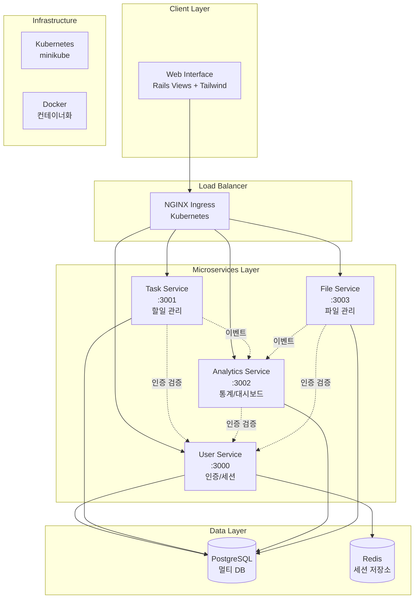

# TaskMate

마이크로서비스 아키텍처 기반 할일 관리 플랫폼

## 📋 프로젝트 소개

TaskMate는 Ruby on Rails 8을 기반으로 구축된 마이크로서비스 아키텍처(MSA) 할일 관리 애플리케이션입니다. 
4개의 독립적인 서비스로 구성되어 있으며, Kubernetes 환경에서 운영됩니다.

## 🏗️ 시스템 아키텍처



## 🚀 마이크로서비스 구성

| 서비스 | 포트 | 데이터베이스 | 주요 기능 | 상태 |
|--------|------|---------------|-----------|------|
| **User Service** | 3000 | user_service_db | 인증, 세션 관리, 프로필 | ✅ 모델 완료 |
| **Task Service** | 3001 | task_service_db | 할일 CRUD, 상태 관리 | ⏳ 대기 중 |
| **Analytics Service** | 3002 | analytics_service_db | 통계, 대시보드 | ⏳ 대기 중 |
| **File Service** | 3003 | file_service_db | 파일 첨부, 관리 | ⏳ 대기 중 |

## 🛠️ 기술 스택

### Backend
- **Framework**: Ruby on Rails 8.0.2 (API Mode)
- **Language**: Ruby 3.4.3 (rbenv)
- **Database**: PostgreSQL 15 (멀티 데이터베이스)
- **Cache**: Redis 7-alpine
- **Authentication**: Session 기반 (BCrypt)

### Frontend
- **View Engine**: Rails Views (ERB)
- **CSS Framework**: Tailwind CSS
- **JavaScript**: Turbo + Stimulus
- **UI Components**: Responsive Design

### Infrastructure
- **Containerization**: Docker & Docker Compose
- **Orchestration**: Kubernetes (minikube)
- **Load Balancer**: NGINX Ingress Controller
- **Monitoring**: Prometheus + Grafana (예정)

### Development
- **Testing**: RSpec + FactoryBot
- **Code Coverage**: SimpleCov
- **API Documentation**: OpenAPI 3.0
- **Development Approach**: TDD (Test-Driven Development)

## 🗂️ 프로젝트 구조

```
taskmate/                           # 🏠 메인 프로젝트 (Monorepo)
├── 📁 services/                    # 마이크로서비스들
│   ├── 🟢 user-service/           # User Service (✅ 진행 중)
│   │   ├── app/models/            # User, Session 모델
│   │   ├── spec/                  # RSpec 테스트 (27개 통과)
│   │   └── db/migrate/            # 데이터베이스 마이그레이션
│   ├── ⚪ task-service/           # Task Service (⏳ 대기)
│   ├── ⚪ analytics-service/      # Analytics Service (⏳ 대기)
│   └── ⚪ file-service/           # File Service (⏳ 대기)
├── 📁 k8s/                        # Kubernetes 매니페스트
│   ├── deployments/               # 서비스 배포 설정
│   ├── services/                  # 서비스 디스커버리
│   ├── ingress/                   # 로드 밸런싱
│   └── configmaps/                # 환경 설정
├── 📁 docker/                     # Docker 설정
│   ├── development/               # 개발 환경
│   └── production/                # 프로덕션 환경
├── 📁 docs/                       # 프로젝트 문서
│   ├── API_SPECIFICATION.md      # OpenAPI 3.0 명세
│   ├── TDD_GUIDE.md              # 테스트 가이드라인
│   ├── PHASE2_EXECUTION_PLAN.md  # 구현 체크리스트
│   └── SETUP.md                  # 환경 설정 가이드
├── 📁 scripts/                    # 개발 스크립트
│   ├── setup.sh                  # 환경 초기화
│   ├── dev.sh                    # 개발 서버 실행
│   └── test.sh                   # 테스트 실행
├── 🐳 docker-compose.yml         # 로컬 개발 환경
└── 📋 CLAUDE.md                  # AI 개발 가이드
```

## 🔄 Git 구성 및 브랜치 전략

### Repository 구조
```
🌳 Main Repository (Monorepo)
├── 📦 services/user-service      # 개별 서비스 (독립 개발)
├── 📦 services/task-service      # 각 서비스는 독립적으로 개발
├── 📦 services/analytics-service # 하지만 동일한 저장소에서 관리
└── 📦 services/file-service      # 통합 배포 및 버전 관리
```

### 개발 워크플로우
- **Main Branch**: `main` - 안정된 코드, 프로덕션 준비
- **Feature Branch**: 각 기능별 브랜치 생성
- **TDD Cycle**: Red → Green → Refactor → Commit
- **Conventional Commits**: `feat(user-service): 기능 설명`

## ⚙️ 개발 환경 설정

### 필수 요구사항

- **Ruby 3.4.3** (rbenv 권장)
- **Rails 8.0.2**
- **PostgreSQL 15+**
- **Redis 7+**
- **Docker & Docker Compose**
- **minikube** (Kubernetes 로컬 환경)

### 🚀 빠른 시작

```bash
# 1. 프로젝트 클론
git clone <repository-url>
cd taskmate

# 2. 개발 환경 초기화
./scripts/setup.sh

# 3. Docker 서비스 시작
docker-compose up -d

# 4. 개발 서버 실행
./scripts/dev.sh
```

### 🧪 테스트 실행

```bash
# 전체 테스트 실행
./scripts/test.sh

# 특정 서비스 테스트
cd services/user-service
bundle exec rspec
```

## 📚 개발 진행 상황

### Phase 2: 핵심 서비스 개발 (진행 중)

- ✅ **User Service 모델 계층** (2025-08-16 완료)
  - User 모델 (BCrypt 암호화, 이메일 검증)
  - Session 모델 (UUID 토큰, 자동 만료)
  - RSpec 테스트 27개 통과
  - TDD 사이클 완료

- ⏳ **다음 단계**: AuthController API 구현
  - 회원가입/로그인/로그아웃 API
  - 세션 검증 API (서비스 간 통신용)
  - API 응답 형식 표준화

## 📖 문서

| 문서 | 설명 |
|------|------|
| [docs/PROJECT_PLAN.md](docs/PROJECT_PLAN.md) | 📋 전체 개발 계획 및 진행 상황 |
| [docs/API_SPECIFICATION.md](docs/API_SPECIFICATION.md) | 🔌 OpenAPI 3.0 API 명세서 |
| [docs/TDD_GUIDE.md](docs/TDD_GUIDE.md) | 🧪 TDD 개발 가이드라인 |
| [docs/SETUP.md](docs/SETUP.md) | ⚙️ 상세 환경 설정 가이드 |
| [CLAUDE.md](CLAUDE.md) | 🤖 AI 개발 지침 |

## 📊 현재 상태

| 항목 | 진행률 | 상태 |
|------|--------|------|
| **Infrastructure** | 100% | ✅ 완료 |
| **User Service** | 50% | 🔄 진행 중 |
| **Task Service** | 0% | ⏳ 대기 |
| **Analytics Service** | 0% | ⏳ 대기 |
| **File Service** | 0% | ⏳ 대기 |
| **Frontend** | 0% | ⏳ 대기 |
| **Kubernetes** | 0% | ⏳ 대기 |

## 🤝 기여 방법

1. Feature 브랜치 생성
2. TDD 사이클 준수 (Red → Green → Refactor)
3. Conventional Commits 사용
4. 테스트 커버리지 80% 이상 유지

## 📄 라이센스

MIT License - 자세한 내용은 [LICENSE](LICENSE) 파일을 참고하세요.

---

*🎓 이 프로젝트는 마이크로서비스 아키텍처 학습을 위한 졸업 작품입니다.*
