# TaskMate

마이크로서비스 아키텍처 기반 할일 관리 플랫폼

## 📋 프로젝트 소개

TaskMate는 Ruby on Rails 8을 기반으로 구축된 **마이크로서비스 아키텍처(MSA)** 할일 관리 애플리케이션입니다. 
**5개의 독립적인 서비스**로 구성되어 있으며, **Docker + Kubernetes 환경**에서 운영됩니다.

## 🎯 현재 구현 상태 (2025-10-14)

**전체 완성도**: **100%** ✅ (Kubernetes 운영 환경 검증 완료)

| 서비스 | 구현률 | API 수 | 테스트 | Kubernetes | 상태 |
|--------|--------|--------|--------|-------------|------|
| **User Service** | 100% | 4/4 | 53개 통과 | ✅ READY | ✅ 완료 |
| **Task Service** | 100% | 6/6 | 39개 통과 | ✅ READY | ✅ 완료 |
| **Analytics Service** | 100% | 6/6 | 30개 통과 | ✅ READY | ✅ 완료 |
| **File Service** | 100% | 10/10 | 45개 통과 | ✅ READY | ✅ 완료 |
| **Frontend Service** | 100% | - | 6개 통과 | ✅ READY | ✅ 완료 |

## 🏗️ 시스템 아키텍처

### Kubernetes 운영 환경 (현재 배포 상태)

```mermaid
graph TB
    subgraph "Kubernetes Cluster (minikube)"
        subgraph "Ingress Layer"
            ING[NGINX Ingress Controller<br/>192.168.49.2<br/>Host-based Routing]
        end

        subgraph "Application Layer"
            FE[Frontend Service<br/>Port 3100<br/>Rails Views + API Gateway<br/>Pod: frontend-service-95b56f7c4-9dtq9]
        end

        subgraph "Microservices Layer"
            US[User Service<br/>Port 3000<br/>인증/세션 관리<br/>Pod: user-service-746b75847-8dz4q]
            TS[Task Service<br/>Port 3001<br/>할일 CRUD<br/>Pod: task-service-7c84c6d87c-2d97c]
            AS[Analytics Service<br/>Port 3002<br/>통계/대시보드<br/>Pod: analytics-service-55cc87874-l69tt]
            FS[File Service<br/>Port 3003<br/>파일 관리 (URL 기반)<br/>Pod: file-service-86bb8b74d6-xq28k]
        end

        subgraph "Data Layer"
            PG[(PostgreSQL StatefulSet<br/>5개 독립 DB<br/>Pod: postgres-75c47c7679-tttvp)]
            RD[(Redis Deployment<br/>세션 저장소<br/>Pod: redis-7c57fc8679-gtg2q)]
        end

        subgraph "Service Discovery"
            SVC1[user-service<br/>ClusterIP: 10.107.173.196]
            SVC2[task-service<br/>ClusterIP: 10.107.77.173]
            SVC3[analytics-service<br/>ClusterIP: 10.103.51.200]
            SVC4[file-service<br/>ClusterIP: 10.111.33.229]
            SVC5[frontend-service<br/>ClusterIP: 10.104.32.255]
        end
    end

    Client[웹 브라우저] -->|HTTP| ING
    ING -->|Path: /| FE

    FE -->|REST API| US
    FE -->|REST API| TS
    FE -->|REST API| AS
    FE -->|REST API| FS

    TS -->|인증 검증<br/>GET /api/v1/auth/verify| US
    AS -->|인증 검증<br/>Authorization Header| US
    FS -->|인증 검증<br/>Authorization Header| US

    US -->|user_service_db| PG
    TS -->|task_service_db| PG
    AS -->|analytics_service_db| PG
    FS -->|file_service_db| PG

    US -->|Session Storage| RD
    FE -->|Session Read| RD

    US -.-> SVC1
    TS -.-> SVC2
    AS -.-> SVC3
    FS -.-> SVC4
    FE -.-> SVC5

    style ING fill:#f9f,stroke:#333,stroke-width:4px
    style FE fill:#bbf,stroke:#333,stroke-width:2px
    style US fill:#bfb,stroke:#333,stroke-width:2px
    style TS fill:#bfb,stroke:#333,stroke-width:2px
    style AS fill:#bfb,stroke:#333,stroke-width:2px
    style FS fill:#bfb,stroke:#333,stroke-width:2px
    style PG fill:#fbb,stroke:#333,stroke-width:2px
    style RD fill:#fbb,stroke:#333,stroke-width:2px
```

### 주요 특징
- ✅ **7개 Pod** 안정적 운영 (56일간 가동)
- ✅ **8개 ClusterIP Service** 내부 네트워크 통신
- ✅ **NGINX Ingress** 단일 진입점 (192.168.49.2)
- ✅ **세션 기반 인증** User Service 중심 인증 허브
- ✅ **Database per Service** 패턴 (5개 독립 DB)
- ✅ **Service Discovery** Kubernetes DNS 기반 자동 검색

## 🎨 UI 와이어프레임 (구현된 화면)

### Frontend Service 화면 구조 및 API 연동

```mermaid
graph TB
    subgraph "인증 화면"
        LOGIN[로그인 화면<br/>/login<br/>-----------------<br/>이메일 입력<br/>비밀번호 입력<br/>로그인 버튼]
        REGISTER[회원가입 화면<br/>/register<br/>-----------------<br/>이름 입력<br/>이메일 입력<br/>비밀번호 입력<br/>비밀번호 확인<br/>회원가입 버튼]
    end

    subgraph "메인 대시보드"
        DASHBOARD[대시보드<br/>/<br/>-----------------<br/>📊 통계 요약 카드<br/>• 전체 태스크 수<br/>• 완료된 태스크<br/>• 완료율<br/>• 진행 중 태스크<br/>-----------------<br/>📋 최근 태스크 목록<br/>🎯 빠른 작업 링크]
    end

    subgraph "태스크 관리"
        TASKS[태스크 목록<br/>/tasks<br/>-----------------<br/>🔍 검색 & 필터<br/>• 상태별 필터<br/>• 우선순위 필터<br/>-----------------<br/>📋 태스크 카드<br/>• 제목, 설명<br/>• 상태, 우선순위<br/>• 마감일<br/>• 수정/삭제 버튼<br/>-----------------<br/>➕ 새 태스크 버튼]

        TASK_NEW[새 태스크<br/>/tasks/new<br/>-----------------<br/>제목 입력<br/>설명 입력<br/>우선순위 선택<br/>마감일 선택<br/>-----------------<br/>생성 버튼<br/>취소 버튼]

        TASK_EDIT[태스크 수정<br/>/tasks/:id/edit<br/>-----------------<br/>제목 수정<br/>설명 수정<br/>우선순위 변경<br/>마감일 변경<br/>-----------------<br/>저장 버튼<br/>취소 버튼]

        TASK_DETAIL[태스크 상세<br/>/tasks/:id<br/>-----------------<br/>📌 전체 정보 표시<br/>• 제목, 설명<br/>• 상태, 우선순위<br/>• 생성일, 마감일<br/>-----------------<br/>수정 버튼<br/>삭제 버튼<br/>목록 돌아가기]
    end

    subgraph "통계 분석"
        ANALYTICS[통계 대시보드<br/>/analytics<br/>-----------------<br/>📊 Time Period 선택<br/>• 7일, 30일, 90일, 365일<br/>-----------------<br/>📈 차트 영역<br/>• 완료율 게이지<br/>• 우선순위 분포 파이<br/>• 완료 트렌드 라인<br/>-----------------<br/>🔄 새로고침 버튼]
    end

    subgraph "파일 관리"
        FILES[파일 목록<br/>/files<br/>-----------------<br/>📁 카테고리 필터<br/>-----------------<br/>📎 파일 카드<br/>• 파일명<br/>• 타입, 카테고리<br/>• 생성일<br/>• 삭제 버튼<br/>-----------------<br/>➕ URL 추가 버튼]

        FILE_ADD[파일 추가<br/>/files/add_url<br/>-----------------<br/>파일명 입력<br/>파일 URL 입력<br/>타입 선택<br/>카테고리 선택<br/>-----------------<br/>추가 버튼<br/>취소 버튼]
    end

    subgraph "API 연동 흐름"
        API_USER[User Service API<br/>POST /auth/login<br/>POST /auth/register<br/>GET /auth/verify]
        API_TASK[Task Service API<br/>GET /tasks<br/>POST /tasks<br/>PUT /tasks/:id<br/>DELETE /tasks/:id]
        API_ANALYTICS[Analytics Service API<br/>GET /analytics/dashboard<br/>GET /analytics/completion-rate<br/>GET /analytics/priority-distribution]
        API_FILE[File Service API<br/>GET /simple_files<br/>POST /simple_files<br/>DELETE /simple_files/:id]
    end

    %% 인증 흐름
    LOGIN -->|POST /auth/login| API_USER
    REGISTER -->|POST /auth/register| API_USER
    API_USER -->|세션 발급| DASHBOARD

    %% 대시보드 흐름
    DASHBOARD -->|GET /analytics/dashboard| API_ANALYTICS
    DASHBOARD -->|GET /tasks?limit=5| API_TASK
    DASHBOARD --> TASKS
    DASHBOARD --> ANALYTICS
    DASHBOARD --> FILES

    %% 태스크 관리 흐름
    TASKS -->|GET /tasks| API_TASK
    TASKS --> TASK_NEW
    TASKS --> TASK_DETAIL
    TASK_NEW -->|POST /tasks| API_TASK
    TASK_DETAIL --> TASK_EDIT
    TASK_EDIT -->|PUT /tasks/:id| API_TASK
    TASK_DETAIL -->|DELETE /tasks/:id| API_TASK

    %% 통계 분석 흐름
    ANALYTICS -->|GET /analytics/*| API_ANALYTICS

    %% 파일 관리 흐름
    FILES -->|GET /simple_files| API_FILE
    FILES --> FILE_ADD
    FILE_ADD -->|POST /simple_files| API_FILE
    FILES -->|DELETE /simple_files/:id| API_FILE

    %% 스타일링
    style LOGIN fill:#e1f5ff,stroke:#01579b,stroke-width:2px
    style REGISTER fill:#e1f5ff,stroke:#01579b,stroke-width:2px
    style DASHBOARD fill:#fff3e0,stroke:#e65100,stroke-width:3px
    style TASKS fill:#e8f5e9,stroke:#1b5e20,stroke-width:2px
    style TASK_NEW fill:#e8f5e9,stroke:#1b5e20,stroke-width:2px
    style TASK_EDIT fill:#e8f5e9,stroke:#1b5e20,stroke-width:2px
    style TASK_DETAIL fill:#e8f5e9,stroke:#1b5e20,stroke-width:2px
    style ANALYTICS fill:#f3e5f5,stroke:#4a148c,stroke-width:2px
    style FILES fill:#fff9c4,stroke:#f57f17,stroke-width:2px
    style FILE_ADD fill:#fff9c4,stroke:#f57f17,stroke-width:2px
    style API_USER fill:#ffebee,stroke:#c62828,stroke-width:2px
    style API_TASK fill:#ffebee,stroke:#c62828,stroke-width:2px
    style API_ANALYTICS fill:#ffebee,stroke:#c62828,stroke-width:2px
    style API_FILE fill:#ffebee,stroke:#c62828,stroke-width:2px
```



### 화면별 주요 기능

| 화면 | 경로 | 주요 API | 기능 |
|------|------|----------|------|
| 🔐 **로그인** | `/login` | `POST /api/v1/auth/login` | 세션 기반 인증 |
| 📝 **회원가입** | `/register` | `POST /api/v1/auth/register` | 사용자 등록 |
| 🏠 **대시보드** | `/` | `GET /analytics/dashboard`<br/>`GET /tasks?limit=5` | 통계 요약 + 최근 태스크 |
| 📋 **태스크 목록** | `/tasks` | `GET /api/v1/tasks` | 필터링, 검색, 페이지네이션 |
| ➕ **태스크 생성** | `/tasks/new` | `POST /api/v1/tasks` | 새 태스크 추가 |
| 📌 **태스크 상세** | `/tasks/:id` | `GET /api/v1/tasks/:id` | 상세 정보 조회 |
| ✏️ **태스크 수정** | `/tasks/:id/edit` | `PUT /api/v1/tasks/:id` | 태스크 정보 수정 |
| 📊 **통계** | `/analytics` | `GET /analytics/*` | 완료율, 분포, 트렌드 |
| 📁 **파일 목록** | `/files` | `GET /api/v1/simple_files` | URL 기반 파일 관리 |
| ➕ **파일 추가** | `/files/add_url` | `POST /api/v1/simple_files` | URL 기반 파일 추가 |

### UI 기술 스택
- **View Engine**: ERB (Embedded Ruby)
- **CSS Framework**: Tailwind CSS
- **JavaScript**: Turbo + Stimulus
- **반응형**: Mobile-First Design
- **인증**: Session Cookie 기반

## 🚀 마이크로서비스 구성

| 서비스 | 포트 | 데이터베이스 | 주요 기능 | Docker | Kubernetes |
|--------|------|---------------|-----------|--------|------------|
| **User Service** | 3000 | user_service_db | 인증, 세션 관리, 프로필 | ✅ 완료 | ✅ **READY** |
| **Task Service** | 3001 | task_service_db | 할일 CRUD, 상태 관리 | ✅ 완료 | ✅ **READY** |
| **Analytics Service** | 3002 | analytics_service_db | 통계, 대시보드 | ✅ 완료 | ✅ **READY** |
| **File Service** | 3003 | file_service_db | 파일 첨부, 관리 | ✅ 완료 | ✅ **READY** |
| **Frontend Service** | 3100 | - | Web UI, API Gateway | ✅ 완료 | ✅ **READY** |

## 🛠️ 기술 스택

### Backend
- **Framework**: Ruby on Rails 8.0.2 (API Mode)
- **Language**: Ruby 3.4.3 (rbenv)
- **Database**: PostgreSQL 15 (멀티 데이터베이스)
- **Cache**: Redis 7-alpine
- **Authentication**: Session 기반 (BCrypt)

### Frontend
- **View Engine**: Rails Views (ERB)
- **CSS Framework**: Tailwind CSS
- **JavaScript**: Turbo + Stimulus
- **UI Components**: Responsive Design

### Infrastructure
- **Containerization**: Docker & Docker Compose
- **Orchestration**: Kubernetes (minikube)
- **Load Balancer**: NGINX Ingress Controller
- **Service Mesh**: ClusterIP Services

### Development
- **Testing**: RSpec + FactoryBot
- **Code Coverage**: SimpleCov
- **Development Approach**: TDD (Test-Driven Development)

## 🗂️ 프로젝트 구조

```
taskmate/                           # 🏠 메인 프로젝트 (Monorepo)
├── 📁 services/                    # 마이크로서비스들
│   ├── ✅ user-service/           # User Service (100% 완료)
│   │   ├── app/models/            # User, Session 모델 (BCrypt 인증)
│   │   ├── app/controllers/       # AuthController API (4개 엔드포인트)
│   │   ├── spec/                  # RSpec 테스트 (53개 통과, 91.75% 커버리지)
│   │   ├── Dockerfile.dev         # Development Docker 설정
│   │   └── docker-entrypoint.sh   # Container 시작 스크립트
│   ├── ✅ task-service/           # Task Service (100% 완료)
│   │   ├── app/models/            # Task 모델 (상태 관리)
│   │   ├── app/controllers/       # TasksController (6개 API 구현)
│   │   ├── spec/                  # RSpec 테스트 (39개 통과)
│   │   ├── app/services/          # AuthService (인증 연동)
│   │   └── Dockerfile             # Docker 설정
│   ├── ✅ analytics-service/      # Analytics Service (100% 완료)
│   │   ├── app/models/            # TaskAnalytics, UserAnalytics
│   │   ├── app/controllers/       # 통계 분석 API (6개 완전 구현)
│   │   ├── spec/                  # RSpec 테스트 (30개 통과, 88% 커버리지)
│   │   └── Dockerfile             # Docker 설정
│   ├── ✅ file-service/           # File Service (100% 완료)
│   │   ├── app/models/            # FileCategory, SimpleFile (URL 기반)
│   │   ├── app/controllers/       # 파일 관리 API (10개 구현)
│   │   ├── spec/                  # RSpec 테스트 (45개 통과, 92% 커버리지)
│   │   ├── 🔧 Simple Files API/   # URL 기반 파일 시스템
│   │   └── Dockerfile             # Docker 설정
│   └── ✅ frontend-service/       # Frontend Service (100% 완료)
│       ├── app/controllers/       # UI Controllers + Service Clients
│       ├── app/services/          # 4개 백엔드 API 연동 완료
│       ├── app/views/             # Rails Views + Tailwind CSS (반응형)
│       ├── spec/requests/         # RSpec 테스트 (6개 통과)
│       ├── 🎨 UI Components/      # 완전한 사용자 인터페이스
│       └── Dockerfile.dev         # Development Docker 설정
├── 📁 k8s/                        # ✅ Kubernetes 매니페스트 (완료)
│   ├── namespace.yaml             # Namespace, ConfigMap, Secrets
│   ├── infrastructure/            # PostgreSQL, Redis 배포
│   ├── services/                  # 마이크로서비스 배포
│   └── ingress.yaml               # NGINX Ingress 설정
├── 📁 docker/                     # Docker 설정
├── 📁 docs/                       # 프로젝트 문서
├── 📁 scripts/                    # 개발 스크립트
├── 🐳 docker-compose.yml         # 로컬 개발 환경
└── 📋 CLAUDE.md                  # AI 개발 가이드
```

## 🚀 빠른 시작

### 방법 1: Kubernetes (추천)

```bash
# 1. 프로젝트 클론
git clone <repository-url>
cd taskmate

# 2. Minikube 시작
minikube start
minikube addons enable ingress

# 3. Docker 이미지 빌드
eval $(minikube docker-env)
docker-compose build

# 4. Kubernetes 배포
kubectl apply -f k8s/namespace.yaml
kubectl apply -f k8s/database/
kubectl apply -f k8s/services/
kubectl apply -f k8s/ingress.yaml

# 5. 서비스 상태 확인 (모든 Pod이 READY 상태일 때까지 대기)
kubectl get pods -n taskmate -w

# 6. 포트 포워딩으로 접근 (로컬 테스트용)
kubectl port-forward service/frontend-service 3100:3100 -n taskmate

# 7. 웹 브라우저에서 접근
open http://localhost:3100

# 8. 테스트 계정으로 로그인
# 이메일: testtest@test.test
# 비밀번호: password123
# (18개의 샘플 태스크 데이터 포함)
```

### 방법 2: Docker Compose (개발용)

```bash
# 1. 모든 서비스 시작
docker-compose up -d

# 2. 서비스 상태 확인
docker-compose ps

# 3. 웹 브라우저에서 접근
open http://localhost:3100
```

## 🌐 서비스 접근 방법

### Kubernetes 환경 (운영)

**현재 구성**: 포트 포워딩을 통한 로컬 접근

| 서비스 | 포트 포워딩 명령 | 접근 URL | 상태 |
|--------|------------------|----------|------|
| **Frontend Service** | `kubectl port-forward service/frontend-service 3100:3100 -n taskmate` | http://localhost:3100 | ✅ READY |
| **User Service** | `kubectl port-forward service/user-service 3000:3000 -n taskmate` | http://localhost:3000 | ✅ READY |
| **Task Service** | `kubectl port-forward service/task-service 3001:3001 -n taskmate` | http://localhost:3001 | ✅ READY |
| **Analytics Service** | `kubectl port-forward service/analytics-service 3002:3002 -n taskmate` | http://localhost:3002 | ✅ READY |
| **File Service** | `kubectl port-forward service/file-service 3003:3003 -n taskmate` | http://localhost:3003 | ✅ READY |

### Docker Compose 환경 (개발)

| 서비스 | URL | 용도 |
|--------|-----|------|
| **Frontend** | http://localhost:3100 | 웹 인터페이스 |
| **User API** | http://localhost:3000/api/v1 | 사용자 API |
| **Task API** | http://localhost:3001/api/v1 | 태스크 API |
| **Analytics API** | http://localhost:3002/api/v1 | 분석 API |
| **File API** | http://localhost:3003/api/v1 | 파일 API |

## 🧪 테스트 실행

```bash
# 전체 테스트 실행
./scripts/test.sh

# 특정 서비스 테스트 (Docker Compose 환경)
cd services/user-service
bundle exec rspec

# Kubernetes 환경에서 테스트
kubectl exec -n taskmate -it deployment/user-service -- bundle exec rspec
```

## 📊 API 예시

### 인증 API
```bash
# 회원가입
curl -X POST http://api.taskmate.local/api/v1/auth/register \
  -H "Content-Type: application/json" \
  -d '{"name":"홍길동","email":"hong@example.com","password":"password123"}'

# 로그인
curl -X POST http://api.taskmate.local/api/v1/auth/login \
  -H "Content-Type: application/json" \
  -d '{"email":"hong@example.com","password":"password123"}'
```

### 태스크 API
```bash
# 태스크 목록 조회
curl -H "Cookie: session_token=TOKEN" http://api.taskmate.local/api/v1/tasks

# 태스크 생성
curl -X POST http://api.taskmate.local/api/v1/tasks \
  -H "Cookie: session_token=TOKEN" \
  -H "Content-Type: application/json" \
  -d '{"title":"새 할일","description":"설명","priority":"high"}'
```

### 분석 API
```bash
# 대시보드 데이터
curl -H "Cookie: session_token=TOKEN" http://api.taskmate.local/api/v1/analytics/dashboard

# 완료율 통계
curl -H "Cookie: session_token=TOKEN" http://api.taskmate.local/api/v1/analytics/completion-rate
```

## 🔧 개발 환경 설정

### 필수 요구사항

- **Ruby 3.4.3** (rbenv 권장)
- **Rails 8.0.2**
- **PostgreSQL 15+**
- **Redis 7+**
- **Docker & Docker Compose**
- **minikube** (Kubernetes 로컬 환경)
- **kubectl** (Kubernetes CLI)

### Kubernetes 개발 환경 설정

```bash
# 1. Minikube 설치 (macOS)
brew install minikube
minikube start

# 2. Ingress 컨트롤러 활성화
minikube addons enable ingress

# 3. Docker 환경 설정
eval $(minikube docker-env)

# 4. 이미지 빌드
docker-compose build

# 5. Kubernetes 리소스 배포
kubectl apply -f k8s/namespace.yaml
kubectl apply -f k8s/infrastructure/
kubectl apply -f k8s/services/
kubectl apply -f k8s/ingress.yaml

# 6. 상태 확인
kubectl get pods -n taskmate
kubectl get services -n taskmate
kubectl get ingress -n taskmate
```

### 호스트 파일 설정 (필수)

**macOS/Linux:**
```bash
sudo sh -c 'cat << EOF >> /etc/hosts
# TaskMate Kubernetes Local Development
192.168.49.2 taskmate.local
192.168.49.2 api.taskmate.local
192.168.49.2 user.taskmate.local
192.168.49.2 task.taskmate.local
192.168.49.2 analytics.taskmate.local
192.168.49.2 file.taskmate.local
EOF'
```

**Windows:**
관리자 권한으로 `C:\Windows\System32\drivers\etc\hosts` 파일에 추가:
```
192.168.49.2 taskmate.local
192.168.49.2 api.taskmate.local
192.168.49.2 user.taskmate.local
192.168.49.2 task.taskmate.local
192.168.49.2 analytics.taskmate.local
192.168.49.2 file.taskmate.local
```

## 🐛 트러블슈팅

### Kubernetes 관련 문제

```bash
# Pod 상태 확인
kubectl get pods -n taskmate

# Pod 로그 확인
kubectl logs -n taskmate deployment/user-service

# Pod 재시작
kubectl delete pods -n taskmate -l app=user-service

# 리소스 정리 후 재배포
kubectl delete namespace taskmate
kubectl apply -f k8s/
```

### Docker 관련 문제

```bash
# 컨테이너 로그 확인
docker-compose logs user-service

# 특정 서비스 재시작
docker-compose restart user-service

# 전체 환경 재시작
docker-compose down && docker-compose up -d
```

### 네트워크 문제

```bash
# Minikube IP 확인
minikube ip

# Ingress 주소 확인
kubectl get ingress -n taskmate

# DNS 해결 확인
nslookup taskmate.local
```

## 📚 개발 진행 상황

### Phase 1-4: 핵심 개발 ✅ **완료** (2025-08-28)
### Phase 5: Kubernetes 마이그레이션 ✅ **완료** (2025-09-01)

- ✅ **User Service** - 인증/세션 관리 (Kubernetes READY)
- ✅ **Task Service** - 할일 관리 (Kubernetes READY) 
- ✅ **Analytics Service** - 통계/대시보드 (Kubernetes READY)
- ✅ **File Service** - 파일 관리 (Kubernetes READY)
- ✅ **Frontend Service** - 웹 UI + API Gateway (Kubernetes READY)

### 마이그레이션 성과
- ✅ Docker Compose → Kubernetes 완전 전환
- ✅ 5개 마이크로서비스 모두 READY 상태
- ✅ ConfigMaps, Secrets, PVC 완전 구성
- ✅ NGINX Ingress Controller 설정
- ✅ Health Checks & Probes 모든 서비스 적용
- ✅ E2E 사용자 워크플로우 검증 완료

### 현재 상태

| 항목 | 진행률 | 상태 | 업데이트 |
|------|--------|------|----------|
| **Infrastructure** | 100% | ✅ 완료 | PostgreSQL + Redis |
| **User Service** | 100% | ✅ 완료 | K8s READY 상태 |
| **Task Service** | 100% | ✅ 완료 | K8s READY 상태 |
| **Analytics Service** | 100% | ✅ 완료 | K8s READY 상태 |
| **File Service** | 100% | ✅ 완료 | K8s READY 상태 |
| **Frontend Service** | 100% | ✅ 완료 | K8s READY 상태 |
| **Kubernetes** | 100% | ✅ 완료 | 5/5 서비스 완료 |
| **Ingress** | 100% | ✅ 완료 | NGINX 라우팅 완료 |

## 📖 문서

| 문서 | 설명 | 상태 |
|------|------|------|
| [docs/PROJECT_PLAN.md](docs/PROJECT_PLAN.md) | 📋 전체 개발 계획 및 진행 상황 | ✅ 최신 |
| [docs/API_SPECIFICATION.md](docs/API_SPECIFICATION.md) | 🔌 OpenAPI 3.0 API 명세서 | ✅ 완료 |
| [docs/TDD_GUIDE.md](docs/TDD_GUIDE.md) | 🧪 TDD 개발 가이드라인 | ✅ 완료 |
| [docs/SETUP.md](docs/SETUP.md) | ⚙️ 상세 환경 설정 가이드 | 🔄 업데이트 필요 |
| [CLAUDE.md](CLAUDE.md) | 🤖 AI 개발 지침 | ✅ 최신 |

## 🤝 기여 방법

1. Feature 브랜치 생성
2. TDD 사이클 준수 (Red → Green → Refactor)
3. Conventional Commits 사용
4. 테스트 커버리지 80% 이상 유지
5. Kubernetes 매니페스트 업데이트

## 📄 라이센스

MIT License - 자세한 내용은 [LICENSE](LICENSE) 파일을 참고하세요.

---

*🎓 이 프로젝트는 마이크로서비스 아키텍처와 Kubernetes 학습을 위한 졸업 작품입니다.*

**최종 업데이트**: 2025-10-14 - Kubernetes 운영 환경 검증 완료 ✅

### 🏆 프로젝트 완성 현황
- ✅ **마이크로서비스 아키텍처**: 5개 독립 서비스 구현 및 운영 중
- ✅ **Docker → Kubernetes 마이그레이션**: 완전 전환 완료
- ✅ **TDD 기반 개발**: 총 173개 테스트 통과
- ✅ **Production-Ready**: ConfigMaps, Secrets, Health Checks, Liveness/Readiness Probes
- ✅ **사용자 워크플로우**: E2E 시나리오 검증 완료 (실제 운영 테스트 완료)
- ✅ **운영 환경**: kubectl port-forward를 통한 실제 접속 검증
- ✅ **테스트 데이터**: 18개 샘플 태스크 정상 조회
- ✅ **문서화**: 기술 문서 및 운영 가이드 완성

**다음 단계**: Phase 6 모니터링 시스템 (Prometheus + Grafana)