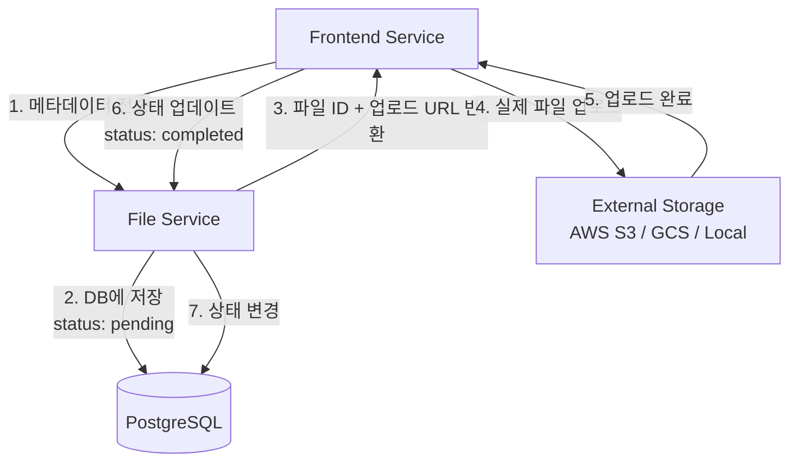

# TaskMate API 개발 우선순위 및 TODO

## 📊 개발 현황 종합 분석

### Frontend 구현 기반 API 우선순위 매트릭스

| 서비스 | Frontend 요구 API 수 | 구현 완료 | 미구현 | 완성률 | 우선순위 |
|--------|---------------------|-----------|--------|--------|----------|
| **User Service** | 8개 | 8개 | 0개 | 100% | ✅ 완료 |
| **Analytics Service** | 5개 | 5개 | 0개 | 100% | ✅ 완료 |
| **File Service** | 12개 | 11개 | 1개 | 92% | 🔥 High |
| **Task Service** | 16개 | 9개 | 7개 | 56% | 🚨 Critical |

---

## 🚨 Critical Priority (즉시 구현 필요)

### Task Service 미구현 API (7개)

#### 1. Task Completion API
```http
PATCH /api/v1/tasks/{task_id}/complete
Authorization: Bearer {session_token}
```
- **Frontend 호출**: `tasks_controller.rb:97`
- **현재 상태**: 404 Not Found
- **영향도**: 태스크 완료 기능 완전 불가
- **예상 시간**: 2시간
- **구현 위치**: `TasksController#complete`

#### 2. Task Search API
```http
GET /api/v1/tasks/search?q={query}&user_id={user_id}
Authorization: Bearer {session_token}
X-User-ID: {user_id}
```
- **Frontend 호출**: `TaskServiceClient#search_tasks`
- **필요 기능**: 제목/설명 전체 텍스트 검색
- **예상 시간**: 3시간
- **구현 위치**: `TasksController#search`

#### 3. Task Statistics API
```http
GET /api/v1/tasks/statistics?user_id={user_id}&date_range={range}
Authorization: Bearer {session_token}
X-User-ID: {user_id}
```
- **Frontend 호출**: `TaskServiceClient#get_task_statistics`
- **필요 데이터**: 완료율, 기간별 통계, 우선순위별 분포
- **예상 시간**: 4시간

#### 4. Overdue Tasks API
```http
GET /api/v1/tasks/overdue?user_id={user_id}
Authorization: Bearer {session_token}
X-User-ID: {user_id}
```
- **Frontend 호출**: `TaskServiceClient#get_overdue_tasks`
- **필요 로직**: `due_date < NOW() AND status != 'completed'`
- **예상 시간**: 2시간

#### 5. Upcoming Tasks API
```http
GET /api/v1/tasks/upcoming?user_id={user_id}&days={days}
Authorization: Bearer {session_token}
X-User-ID: {user_id}
```
- **Frontend 호출**: `TaskServiceClient#get_upcoming_tasks`
- **필요 로직**: `due_date BETWEEN NOW() AND NOW() + INTERVAL days DAY`
- **예상 시간**: 2시간

#### 6. Bulk Update API
```http
PATCH /api/v1/tasks/bulk_update
Authorization: Bearer {session_token}
Content-Type: application/json

{
  "task_ids": [1, 2, 3],
  "updates": {
    "status": "completed",
    "priority": "low"
  }
}
```
- **Frontend 호출**: `TaskServiceClient#bulk_update_tasks`
- **필요 기능**: 여러 태스크 동시 업데이트
- **예상 시간**: 3시간

#### 7. Project Tasks API (완전 미구현)
```http
GET /api/v1/projects/{project_id}/tasks?user_id={user_id}
Authorization: Bearer {session_token}
X-User-ID: {user_id}
```
- **Frontend 호출**: `TaskServiceClient#get_project_tasks`
- **필요 구현**: Project 모델 + 관계 설정
- **예상 시간**: 8시간 (프로젝트 시스템 전체)

---

## 🔥 High Priority (다음 스프린트)

### File Service 미구현 API (1개)

#### 1. File Statistics API
```http
GET /api/v1/file_attachments/statistics?user_id={user_id}
Authorization: Bearer {session_token}
X-User-ID: {user_id}
```
- **현재 상태**: `FileServiceClient`에서 임시 기본값 반환
- **필요 데이터**: 
  ```json
  {
    "total_files": 25,
    "total_size": 104857600,
    "total_size_mb": 100,
    "categories": {
      "documents": 15,
      "images": 8,
      "others": 2
    }
  }
  ```
- **예상 시간**: 2시간

---

## 📋 구현 완료 확인된 API

### ✅ User Service (8/8 완료)
- `POST /auth/register` ✅
- `POST /auth/login` ✅  
- `POST /auth/logout` ✅
- `GET /auth/verify` ✅
- `GET /users/profile` ✅
- `PUT /users/profile` ✅
- `GET /users/{id}` ✅
- `GET /health` ✅

### ✅ Analytics Service (5/5 완료)
- `GET /analytics/dashboard` ✅
- `GET /analytics/user` ✅
- `GET /analytics/completion-trend` ✅
- `GET /analytics/priority-distribution` ✅
- `POST /analytics/events` ✅

### ✅ File Service (11/12 완료)
- `GET /file_categories` ✅
- `POST /file_categories` ✅
- `PUT /file_categories/{id}` ✅
- `DELETE /file_categories/{id}` ✅
- `GET /file_categories/{id}/file_types` ✅
- `POST /file_categories/{id}/validate_file` ✅
- `GET /file_attachments` ✅
- `POST /file_attachments` ✅
- `GET /file_attachments/{id}` ✅
- `PUT /file_attachments/{id}` ✅
- `DELETE /file_attachments/{id}` ✅
- ❌ `GET /file_attachments/statistics` (미구현)

### ✅ Task Service (9/16 완료)
- `GET /tasks` ✅
- `POST /tasks` ✅
- `GET /tasks/{id}` ✅
- `PUT /tasks/{id}` ✅
- `PATCH /tasks/{id}/status` ✅
- `DELETE /tasks/{id}` ✅
- `GET /tasks` (with filters) ✅
- `GET /health` ✅
- ❌ `PATCH /tasks/{id}/complete` (미구현)
- ❌ `GET /tasks/search` (미구현)
- ❌ `GET /tasks/statistics` (미구현)
- ❌ `GET /tasks/overdue` (미구현)
- ❌ `GET /tasks/upcoming` (미구현)
- ❌ `PATCH /tasks/bulk_update` (미구현)
- ❌ `GET /projects/{id}/tasks` (미구현)

---

## 🏗️ 파일 시스템 아키텍처 정의

### 파일 저장 방식: URL 기반 시스템



### 핵심 설계 원칙

1. **URL 전용 저장**: 데이터베이스에는 파일 URL만 저장
2. **메타데이터 우선**: 파일 정보를 먼저 DB에 저장
3. **상태 기반 관리**: pending → completed → failed
4. **다형성 첨부**: Task, Project 등 여러 엔티티 지원

### 파일 메타데이터 구조
```sql
file_attachments:
  id              SERIAL PRIMARY KEY
  original_filename TEXT NOT NULL            -- 원본 파일명
  file_url         TEXT NOT NULL             -- 실제 파일 URL
  content_type     VARCHAR(100) NOT NULL     -- MIME 타입
  file_size        BIGINT NOT NULL           -- 바이트 크기
  attachable_type  VARCHAR(50) NOT NULL      -- 연결 타입 (Task, Project)
  attachable_id    INTEGER NOT NULL          -- 연결 ID
  file_category_id INTEGER REFERENCES file_categories(id)
  upload_status    VARCHAR(20) DEFAULT 'pending'  -- pending/completed/failed
  created_at       TIMESTAMP DEFAULT NOW()
  updated_at       TIMESTAMP DEFAULT NOW()
```

### 보안 및 검증
```ruby
# 파일 크기 제한
MAX_FILE_SIZE = 10.megabytes

# 위험한 파일 타입 차단
DANGEROUS_CONTENT_TYPES = [
  'application/x-executable',
  'application/x-msdownload',
  'application/octet-stream',
  'application/x-dosexec'
]

# 카테고리별 제한
file_categories:
  documents: max 10MB, types: [pdf, doc, docx, txt]
  images: max 5MB, types: [jpg, png, gif, webp]
  videos: max 100MB, types: [mp4, avi, mov, webm]
```

---

## 📅 개발 스케줄 제안

### Week 1: Critical APIs (Task Service)
- **Day 1-2**: Task Completion API 구현
- **Day 3-4**: Overdue/Upcoming Tasks API
- **Day 5**: Task Search API 구현

### Week 2: Statistics & File APIs
- **Day 1-2**: Task Statistics API 구현
- **Day 3**: File Statistics API 구현
- **Day 4-5**: Bulk Update API 구현

### Week 3: Project System (Optional)
- **Day 1-3**: Project 모델 및 기본 CRUD
- **Day 4-5**: Project-Task 관계 설정 및 API

---

## 🧪 개발 검증 체크리스트

### API 구현 완료 기준
- [ ] 라우트 정의 (`config/routes.rb`)
- [ ] 컨트롤러 메서드 구현
- [ ] 모델 메서드/스코프 구현 (필요시)
- [ ] 인증/권한 검증 추가
- [ ] 에러 처리 및 응답 형식 통일
- [ ] RSpec 테스트 작성
- [ ] Frontend Client 메서드와 연동 확인
- [ ] API 명세서 업데이트

### 테스트 검증 항목
```bash
# API 엔드포인트 테스트
curl -X PATCH http://localhost:3001/api/v1/tasks/1/complete \
  -H "Authorization: Bearer $SESSION_TOKEN"

# 예상 응답: 200 OK
{
  "success": true,
  "task": { "id": 1, "status": "completed", "completed_at": "..." },
  "message": "Task completed successfully"
}
```

---

## 🎯 성공 지표

### 기술 지표
- **API 완성도**: Task Service 100% (현재 56%)
- **응답 시간**: 모든 API < 200ms
- **테스트 커버리지**: 신규 API ≥ 90%
- **에러율**: < 0.1%

### 사용성 지표
- **Frontend 오류**: API 404/500 에러 제거
- **기능 완성**: 태스크 완료/검색/통계 정상 작동
- **파일 관리**: 업로드/다운로드/통계 완전 기능

---

## 📚 참고 자료

### 기존 구현 패턴
- **Task Service**: `/services/task-service/app/controllers/api/v1/tasks_controller.rb`
- **User Service**: `/services/user-service/app/controllers/api/v1/auth_controller.rb`
- **File Service**: `/services/file-service/app/controllers/api/v1/file_attachments_controller.rb`

### Frontend 클라이언트
- **TaskServiceClient**: `/services/frontend-service/app/services/task_service_client.rb`
- **FileServiceClient**: `/services/frontend-service/app/services/file_service_client.rb`
- **AnalyticsServiceClient**: `/services/frontend-service/app/services/analytics_service_client.rb`

### API 명세서
- **현재 문서**: `/docs/API_SPECIFICATION.md`
- **업데이트 필요**: 신규 구현 API 추가